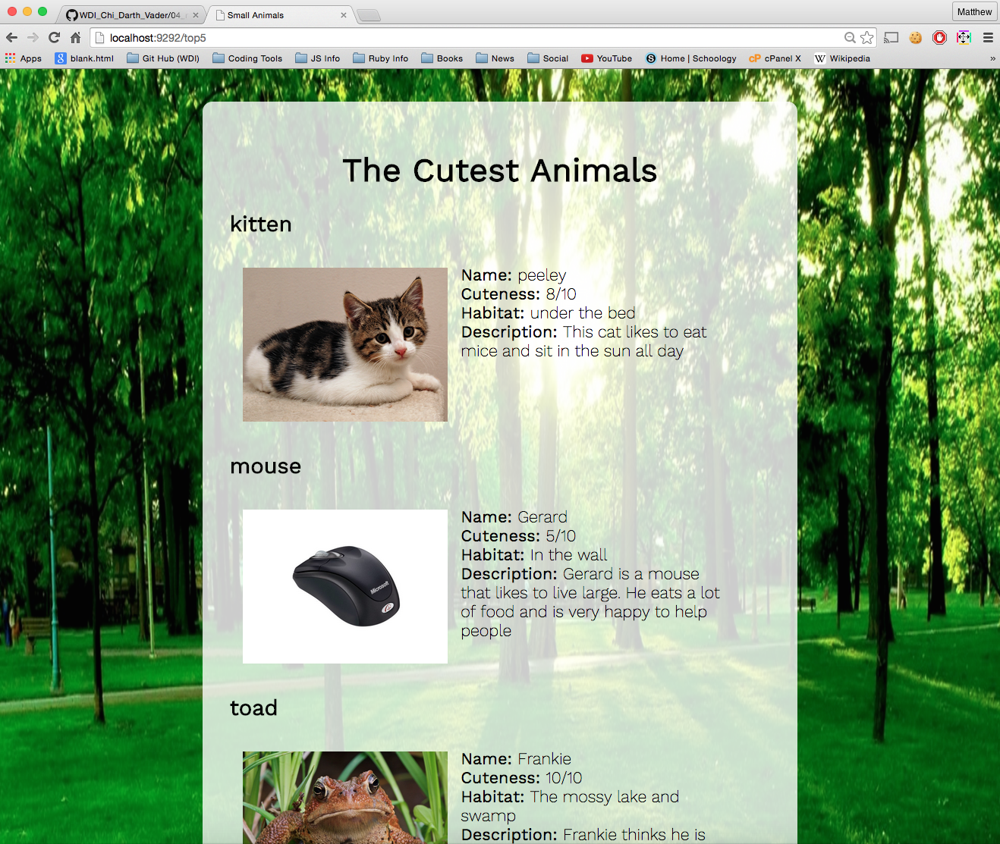

#Cute Cuddly Little Animals
This homework displayed my ability to rapidly deploy a server using Ruby and Sinatra.  The homework was to build 5 static APIs with the names and characteristics of cute small animals with attributes like habitate, cuteness and descriptions

##Features
A full rendered version of the API in HTML styled using SASS and rendered to the .erb views with the help of some JavaScript and jQuery

##What I Learned
* I learned a ton about connecting the back end to the front end
* I learned a bit more about AJAX calls and how they are asynchronous
* Rendering elements to the DOM using data retrieved from an AJAX call
* The fact that Sinatra is an amazing utility for building scalable web applications
* The JSON library in Ruby (also called a 'Gem..... GEM!')
* I love WDI!
* I love WDI!
* I love WDI!
* I love WDI!
* I love WDI!
* I love WDI!
* I love WDI!
* I love WDI!
* I love WDI!
* I love WDI!
* I love WDI!
* I love WDI!
* I love WDI!
* I love WDI!
* I love WDI!
* I love WDI!
* I love WDI!
* I love WDI!
* I love WDI!
* I love WDI!
* I love WDI!
* I love WDI!
* I love WDI!
* I love WDI!
* I love WDI!
* I love WDI!
* I love WDI!
* I love WDI!
* I love WDI!
* I love WDI!
* I love WDI!
* I love WDI!
* I love WDI!
* I love WDI!
* I love WDI!
* I love WDI!
* I love WDI!
* I love WDI!
* I love WDI!
* I love WDI!
* I love WDI!
* I love WDI!
* I love WDI!
* I love WDI!
* I love WDI!
* I love WDI!
* I love WDI!
* I love WDI!
* I love WDI!
* I love WDI!
* I love WDI!
* I love WDI!
* I love WDI!
* I love WDI!
* I love WDI!
* I love WDI!
* I love WDI!
* I love WDI!
* I love WDI!
* I love WDI!
* I love WDI!
* I love WDI!
* I love WDI!
* I love WDI!
* I love WDI!
* I love WDI!
* I love WDI!
* I love WDI!
* I love WDI!
* I love WDI!
* I love WDI!
* I love WDI!
* I love WDI!
* I love WDI!
* I love WDI!
* I love WDI!
* I love WDI!
* I love WDI!
* I love WDI!
* I love WDI!
* I love WDI!
* I love WDI!
* I love WDI!
* I love WDI!
* I love WDI!
* I love WDI!
* I love WDI!
* I love WDI!
* I love WDI!
* I love WDI!
* I love WDI!
* I love WDI!
* I love WDI!
* I love WDI!
* I love WDI!
* I love WDI!
* I love WDI!
* I love WDI!
* I love WDI!
* I love WDI!
* I love WDI!
* I love WDI!
* I love WDI!
* I love WDI!
* I love WDI!
* I love WDI!
* I love WDI!
* I love WDI!
* I love WDI!
* I love WDI!
* I love WDI!
* I love WDI!
* I love WDI!
* I love WDI!
* I love WDI!
* I love WDI!
* I love WDI!
* I love WDI!
* I love WDI!
* I love WDI!
* I love WDI!
* I love WDI!
* I love WDI!
* I love WDI!
* I love WDI!
* I love WDI!
* I love WDI!
* I love WDI!
* I love WDI!
* I love WDI!
* I love WDI!
* I love WDI!
* I love WDI!
* I love WDI!
* I love WDI!
* I love WDI!
* I love WDI!
* I love WDI!
* I love WDI!
* I love WDI!
* I love WDI!
* I love WDI!
* I love WDI!
* I love WDI!
* I love WDI!
* I love WDI!
* I love WDI!
* I love WDI!
* I love WDI!
* I love WDI!
* I love WDI!
* I love WDI!
* I love WDI!
* I love WDI!
* I love WDI!
* I love WDI!
* I love WDI!
* I love WDI!
* I love WDI!
* I love WDI!
* I love WDI!
* I love WDI!
* I love WDI!
* I love WDI!
* I love WDI!
* I love WDI!
* I love WDI!
* I love WDI!
* I love WDI!
* I love WDI!
* I love WDI!
* I love WDI!
* I love WDI!
* I love WDI!
* I love WDI!
* I love WDI!
* I love WDI!
* I love WDI!
* I love WDI!
* I love WDI!
* I love WDI!
* I love WDI!
* I love WDI!
* I love WDI!
* I love WDI!
* I love WDI!
* I love WDI!
* I love WDI!
* I love WDI!
* I love WDI!
* I love WDI!
* I love WDI!
* I love WDI!
* I love WDI!
* I love WDI!
* I love WDI!
* I love WDI!
* I love WDI!
* I love WDI!
* I love WDI!
* I love WDI!
* I love WDI!
* I love WDI!
* I love WDI!
* I love WDI!
* I love WDI!
* I love WDI!
* I love WDI!
* I love WDI!
* I love WDI!
* I love WDI!
* I love WDI!
* I love WDI!
* I love WDI!
* I love WDI!
* I love WDI!
* I love WDI!
* I love WDI!
* I love WDI!
* I love WDI!
* I love WDI!
* I love WDI!
* I love WDI!
* I love WDI!
* I love WDI!
* I love WDI!
* I love WDI!
* I love WDI!
* I love WDI!
* I love WDI!
* I love WDI!
* I love WDI!
* I love WDI!
* I love WDI!
* I love WDI!
* I love WDI!
* I love WDI!
* I love WDI!
* I love WDI!
* I love WDI!
* I love WDI!
* I love WDI!
* I love WDI!
* I love WDI!
* I love WDI!
* I love WDI!
* I love WDI!
* I love WDI!
* I love WDI!
* I love WDI!
* I love WDI!
* I love WDI!
* I love WDI!
* I love WDI!
* I love WDI!
* I love WDI!
* I love WDI!
* I love WDI!
* I love WDI!
* I love WDI!
* I love WDI!
* I love WDI!
* I love WDI!
* I love WDI!
* I love WDI!
* I love WDI!
* I love WDI!
* I love WDI!
* I love WDI!
* I love WDI!
* I love WDI!
* I love WDI!
* I love WDI!
* I love WDI!
* I love WDI!
* I love WDI!
* I love WDI!
* I love WDI!
* I love WDI!
* I love WDI!
* I love WDI!
* I love WDI!
* I love WDI!
* I love WDI!
* I love WDI!
* I love WDI!
* I love WDI!
* I love WDI!
* I love WDI!
* I love WDI!
* I love WDI!
* I love WDI!
* I love WDI!
* I love WDI!
* I love WDI!
* I love WDI!
* I love WDI!
* I love WDI!
* I love WDI!
* I love WDI!
* I love WDI!
* I love WDI!
* I love WDI!
* I love WDI!
* I love WDI!
* I love WDI!
* I love WDI!
* I love WDI!
* I love WDI!
* I love WDI!
* I love WDI!
* I love WDI!
