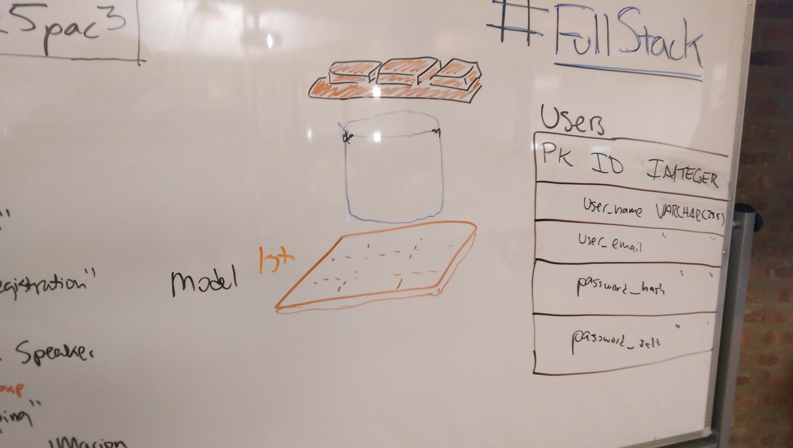

## Week 5, Day 3

#### Block 1: Application Organization

#### Block 2 & 3: CRUD Controllers

* *Lecture Video*: https://www.youtube.com/watch?v=luN12XScptI
* *Sample Controller*: <a href='https://github.com/ga-students/WDI_Chi_Darth_Vader/blob/master/05_full_stack_sinatra/ruby_crud_controller.md'>Link</a>

## After Hours

CRUD Controller/Views!

**Take your Coupons table from las night...!**

1. Update your Sinatra application from last night to utilize CRUD controllers.
2. Create ERB views that represent the data being rendered.
3. Map `<input>` element `names` to Ruby `params[:names]`
4. Create a fully functional Sinatra app that does the following using `GET` and `POST` requests:
  * List all coupons (READ)
  * Create a new coupon (CREATE)
  * Edit a coupon (UPDATE)
  * Delete a coupon (DESTROY)

#### Bonus

Repeat the process for creating a CRUD app for your `sinatra_songs` table from last night.
