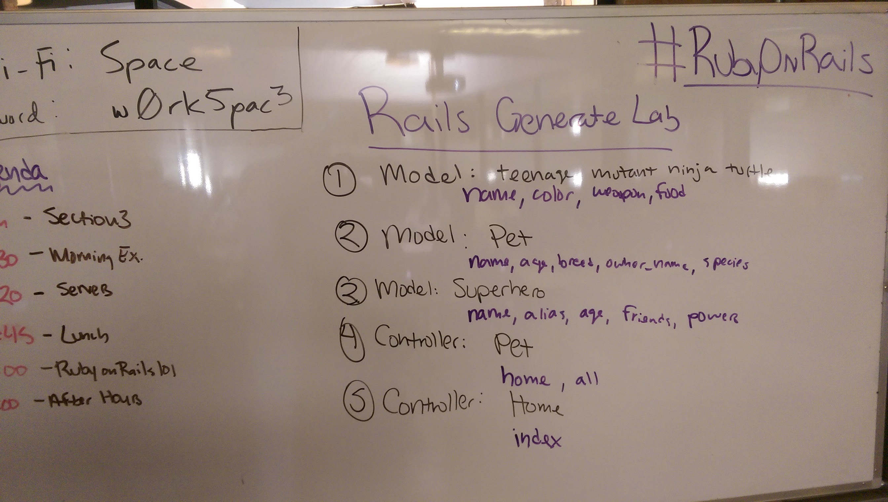

## Rails Generate Lab




#### Remember ActiveRecord? It was built for Rails!

*home_controller.rb*
```ruby
class HomeController < ApplicationController
  def index

    batman = Superhero.new
    batman.name = 'BATMAN'
    batman.alias = 'Bruce Wayne'
    batman.age = 27
    batman.friends = 'dead'
    batman.powers = 'justice'
    batman.save

    @heroes = Superhero.all

  end
end
```

#### ERB also works here!

*index.html.erb*
```html
<h1>Supereroes aren't hard to find</h1>

<% @heroes.each do |hero| %>
  <li><%= hero.name %> (has an alias of <%= hero.alias %>)</li>
<% end %>
```

#### Notice how the names all fit together?

`home_controller.rb` will automatically have views mapped by methods rendered to `/views/controller_name/method_name.html.erb`

We don't have to explicitly call `erb :view_file` to render **ERB Views** like in Sinatra.
