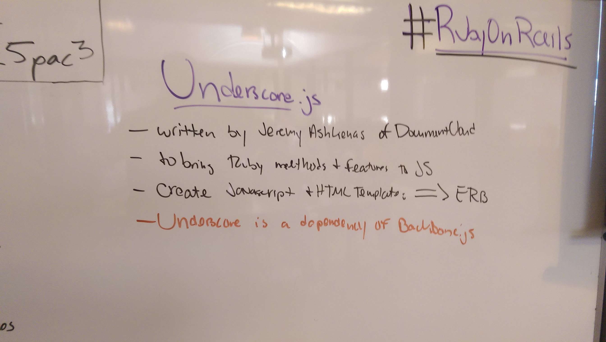

## Underscore.js

- Written by Jeremy Ashkenash
- Designed to bring Ruby methods and features to JS
- Create JS/HTML templates with ERB syntax
- It is a dependency of Backbone.js which we'll learn next week
