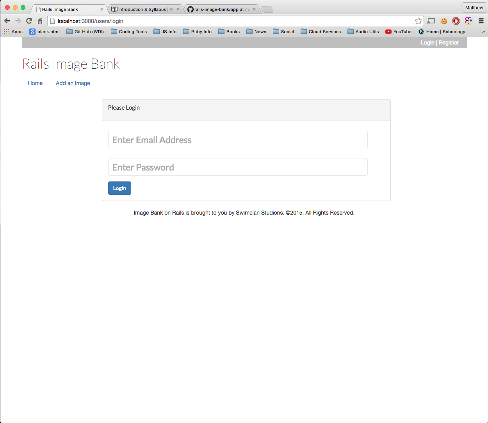
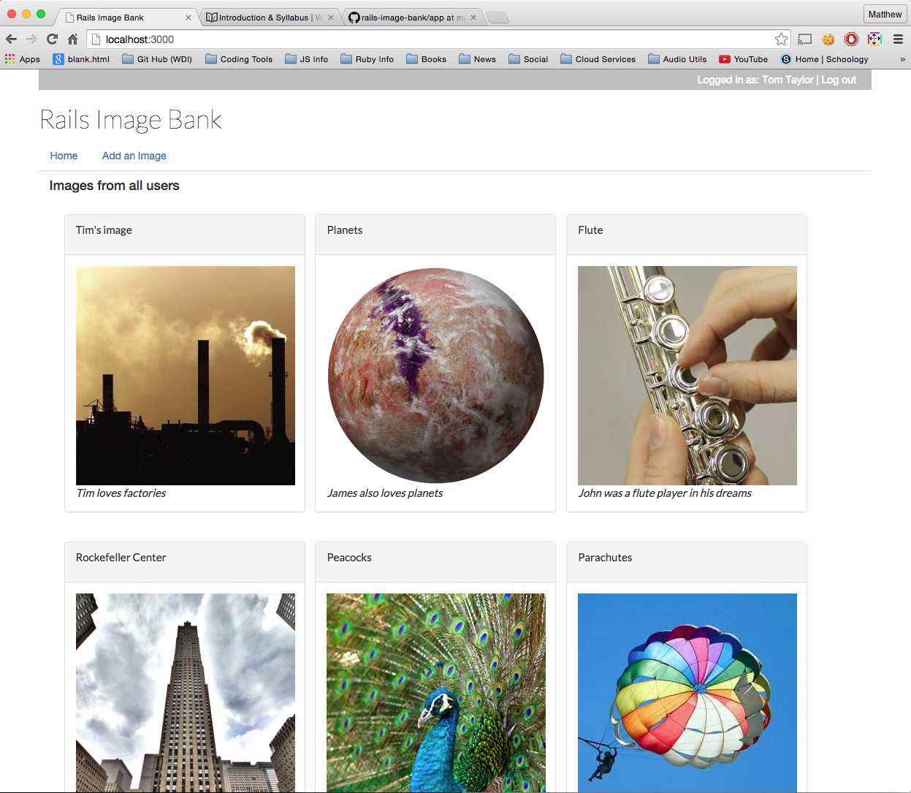
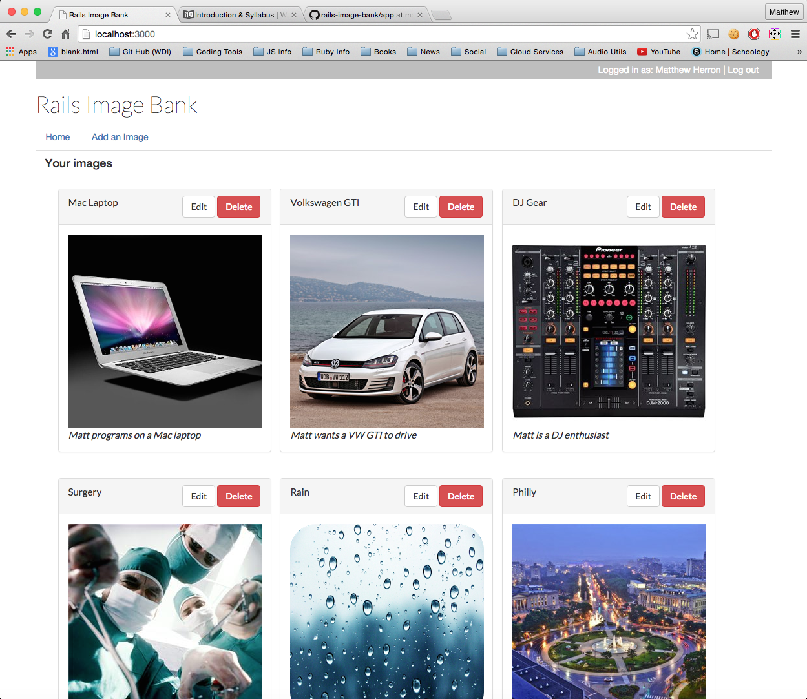
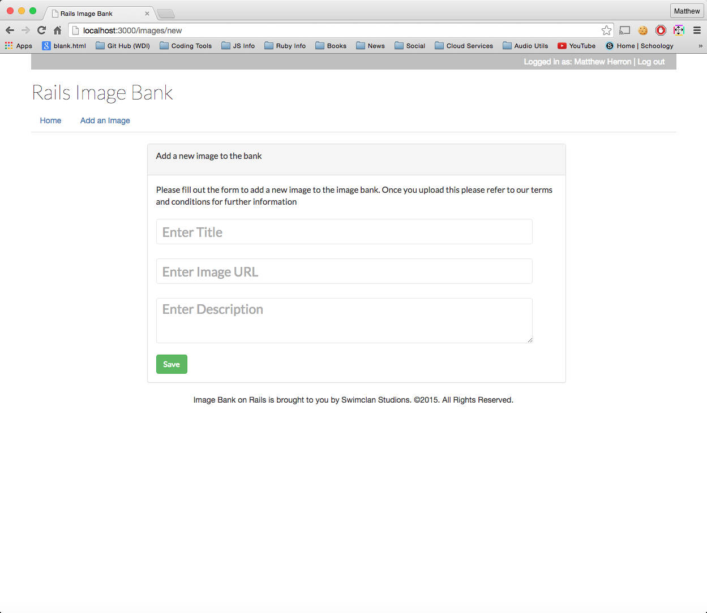

# Homework
## Week 7
### Rails Application

- Create a new Github repository on your account and clone it down
- Create a new Rails application
- Include 2 models: 1 must be user, another for anything...
- Must use sessions/user authentication before accessing resources other than login/logout/registration
- Must utilize at least 3 controllers
- Perform CRUD operations using Rails form_for or form_tag and other helpers on the non-user model
- Style it - Bootstrap is A-ok!
- Push to Github

#### Rails Image Bank

Full project is located on GitHub. [Link to GitHub Repository](https://github.com/swimclan/rails-image-bank)

Allows any user to register, login and save their favorite images in their own image bank.  Users save images by inputting a title, description and internet URL to store into their profile.

#### Login
Easy login that uses email as username key

#### Default Home Page
Shows all users content by default when user does not have any personal images stored yet.  Note that edit and delete buttons do not show in this default mode.

#### Personal Image Bank
Once user is logged in and has at least one image saved to their profile, they see only their personal content with options to edit or delete each one

#### Adding images
Users can add new images to their library at any time to keep it fresh with new content

