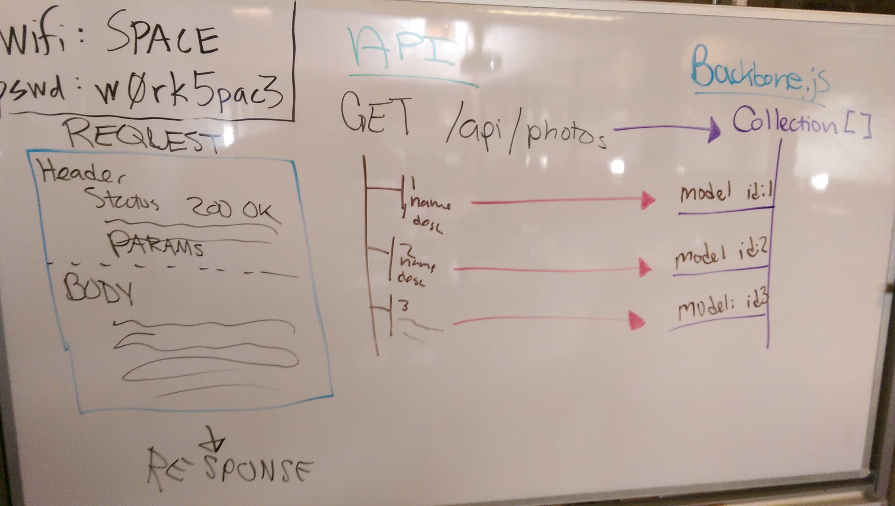

## Backbone.js Collections

#### Questions to Consider

Q: Wouldn't it be nice if we could automatically bind data to the APIs we've been building?

Q: If you could write a really, really simple way to work with an entire API, how would you?

### Introducing Collections

- Imagine being able to communicate directly to an API
- A list of models for each entry in an API
- A... list.... a... COLLECTION
- A collection is the actual Backbone of Backbone.js
- A collection of models; each model is like a vertabrae

