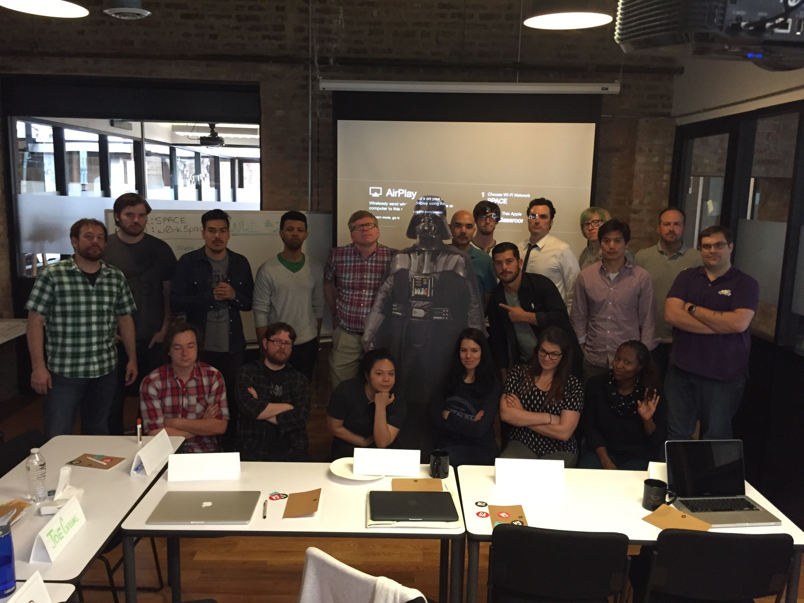

# WDI Darth Vader
**Online Syllabus / Gitbook**

**WE WANT YOU!**

*If you're interested in creating and/or editing a file, please use the wiki template and submit a pull request with your changes! Your instructors will accept the pull request when time is available.*

**Your Instructors & Office Hours**
<table>
  <tr>
    <td>
     <a href="https://github.com/code-for-coffee">James Traver</a>  (code-for-coffee) 
    <em>Office Hours: Monday 5pm - 8pm</em></td>

    <td>
     <a href="https://github.com/theetommyt">Tom Taylor</a>  (theetommyt) 
    <em>Office Hours: Wed 5:00pm - 8pm</em></td>

    <td>
     <a href="https://github.com/rionner">Marion Huebner</a> (rionner) <em>
    Office Hours: Mon-Thurs, 5pm - 8pm</em></td>
  </tr>
</table>

####Chicago's Last Cohort was inspired by...
1. http://prettylightsmusic.com (cool JavaScript)
2. https://casper.com/ (cool video backgrounds, clean, good navigation)
3. http://www.cpbgroup.com/ (dope ass shit. Arguably the top creative agency out there at the moment)
4. http://bowtruss.com/
5. http://youarehere.cc/ (simple layout, cool data visualization)
6. http://activetheory.net/lab (amazigly cool menu)
7. http://www.oecdbetterlifeindex.org/ (data visualization)
8. http://findingho.me/ (3d)
9. http://tiki5k.com
10. http://www.oecdbetterlifeindex.org/#/45545555555
11. http://jutiful.com/
12. http://myincubate.com
13. http://yeoman.io
14. http://www.telescopecards.com/
15. http://www.communitybuildingguide.com/
16. https://www.dtermin.com/ - cool transitioning header
17. http://doejo.com/ - colors
18. http://www.mavenclinic.com/
19. <a href="http://caniuse.com">CanIUse - Reference to see what browser supports what</a>
